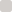
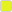
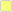
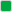
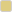
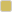
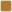
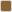

# Ramp Design System — Verified Research & Reproduction Playbook

**Research date:** 2026-07-02
**Rule for this document:** only findings traceable to Ramp itself are included.
Anything from third parties is either validated against primary sources or explicitly
marked unverified. Non-Ramp material is excluded (see §7).

---

## 1. What Ramp actually uses

| Fact | Evidence |
|---|---|
| Internal design system is called **Ryu** (web) and **Mew** (mobile) | Ramp job posting for "Product Designer, Design Systems"; ex-employee resume ("re-architected the build process of Ryu"); Ramp Builders blog post "Bootstrapping a UI component library" (Nov 2021) |
| **Ryu is not public** — no repo, no npm package | No official package exists; the design system ships only inside `app.ramp.com` JS bundles |
| Marketing site (`ramp.com`): Next.js + Tailwind v4, fonts via `next/font` | Shipped HTML/CSS: `/_next/static/*`, Tailwind v4 variable signatures (`--spacing: .25rem`, `lab()` colors) |
| Product app (`app.ramp.com`): Vite + React, CSS-in-JS, tokens in **style-dictionary format** (`{value, type}`) | Sign-in page bundle analysis; token JSON embedded in JS chunks |
| Typeface: **TWK Lausanne**, weights **300 / 350 / 400** (+ italics) | `TWKLausanne_300/350/400*.woff2` served from `ramp.com/_next/static/media/` |
| `font-feature-settings: "ss01" on` | Shipped marketing CSS |
| Ramp's own font fallback stack: `Lausanne, Inter, Roboto, Arial, sans-serif` | Ryu token `fontFamily.sans` extracted from app bundle — **Inter is Ramp's own substitute**, which settles our licensing question |

### Can we get the components to reverse-engineer?

**Component code: no.** Ryu is internal and the app requires auth; component JS is
minified anyway.

**Design tokens: yes — fully.** The complete Ryu token sheet (style-dictionary JSON)
ships to the browser in the sign-in page bundles. We extracted ~290 tokens: primitive
+ semantic colors (including dark mode), typography scale, weights, spacing base,
component dimensions (e.g. table row metrics). That is better raw material than
component code — tokens are the system; components we can see in screenshots.

---

## 2. Verified token sheet (primary sources only)

### 2.1 Typography

| Token | Value | Source |
|---|---|---|
| Family | TWK Lausanne → fallback `Inter, Roboto, Arial, sans-serif` | app bundle |
| Mono | `ui-monospace, 'Cascadia Code', 'Source Code Pro', Menlo, Consolas, 'DejaVu Sans Mono', monospace` | app bundle |
| Signature | `Pacifico, 'Segoe Print', …, cursive` (used for e-sign flows) | app bundle |
| OpenType | `"ss01" on` — required for the Ramp look | marketing CSS |
| Weights | `body: 300`, `headings: 400`, `interactive: 400`, `bold: 700` | app bundle |

The defining trait: **body text is Light (300)** — most reproductions get this wrong
by using 400/500.

Type scale (px, desktop / where responsive both values shown):

| Step | Font size | Line height |
|---|---|---|
| xs | 12 | 16 |
| s | 14 | 20 |
| m (body) | 16 | 24 |
| l | 20 | 28 |
| xl | 28 | 32 |
| 2xl | 40 / 36 | 48 / 40 |
| 3xl | 56 / 44 | 56 / 44 |
| 4xl | 72 / 56 | 68 / 56 |

### 2.2 Color — brand primitives (marketing CSS variable names)

| Name | Hex | Role |
|---|---|---|
| `black` |  `#1a1919` | Primary ink / near-black |
| `text-primary` |  `#0c0a08` | Marketing text ink |
| `grayLight` |  `#f4f2f0` | Warm surface ("limestone") |
| `grayMedium` |  `#d2cecb` | Borders (`--border-primary`) |
| `grayDark` |  `#6e6a68` | Muted text |
| `solar` |  `#e4f222` | **The Ramp lime accent** |
| `solarLight` |  `#f5ff78` | Accent tint |
| `smolder` |  `#17332d` | Deep green (brand surfaces) |
| `spring` |  `#5683d2` | Blue (secondary/info) |
| `springLight` |  `#e4ebf6` | Blue tint |
| gradients | `daylight`, `dusk`, `midnight` | Hero/brand gradients |
| alpha ramp | `black-25…900` = `rgba(33,33,33, .025–.9)` | Overlays/dividers |

### 2.3 Color — Ryu semantic tokens (product app)

| Semantic | Values (light → strong / dark-mode variants) |
|---|---|
| `foreground` |  `#1A1919` |
| `hushed` (muted text — Ryu's own vocabulary) |  `#6E6A68`, dark mode  `#A39D99` |
| `border.primary` |  `#D2CECB` |
| Surfaces |  `#FFFFFF`,  `#F4F2F0`,  `#E9E5E2`; dark:  `#2A2827`,  `#32302F`,  `#474543` |
| `accent` | bg  `#E4F222` + fg  `#1A1919` (lime is always paired with ink) |
| `constructive` (success) |  `#2EC45C`,  `#26763B`,  `#24863E`,  `#01A741`,  `#439858` |
| `destructive` |  `#FF7A36`,  `#CF491E`,  `#B74018`,  `#E9541D` — **orange, not red** |
| `warning` ("mustard") |  `#DECD81`,  `#D1BD61`,  `#AF7A2B`,  `#876634` |
| `secondary` (spring blues) |  `#5683D2`,  `#425E93`,  `#A1B3DF` |
| Data-viz | dedicated `vizColor1–8` palette |
| Text emphasis vocabulary | `hushed` / `default` / `emphasized` |

Two high-signal identity traits to preserve: destructive states are **orange**
(warm palette discipline — no pure red anywhere), and the lime accent is used
sparingly, always with near-black foreground.

### 2.4 Dimensions, radii, elevation

| Token | Value | Source |
|---|---|---|
| Base spacing unit | `4px` | app bundle (`spacing: {value: 4}`) |
| Radii in use | `4px` (controls), `8px`, `12px` / `1rem` (cards, surfaces), `round: 100vmin` (pills/avatars) | app bundle |
| Table metrics | row height `64`, selection column `56`, gutter `44`, border `1px` (sticky header `3px`) | app bundle |
| Elevation | Mostly flat; a small `shadows.level` scale + tooltip shadow exist | app bundle |
| Border width | `1px` standard | app bundle |

---

## 3. Validation of earlier third-party claims

| Claim (source) | Verdict |
|---|---|
| Palette "Obsidian  `#0c0a08`, Limestone  `#f4f2f0`, Bone  `#d2cecb`, Lime  `#e4f222`" (Refero) | **Validated** — all four appear verbatim in Ramp's shipped CSS (Ramp's names differ: grayLight/grayMedium/solar) |
| TWK Lausanne, logo derived from it; Burgess serif in brand (Fonts In Use) | **Validated** for Lausanne (font files confirmed); Burgess not seen in product — brand-only, ignore for app |
| "ss01 is non-negotiable" (Refero) | **Validated** — shipped with `"ss01" on` |
| "Inter is an acceptable substitute" (Refero) | **Validated and upgraded** — Inter is literally Ramp's own fallback in Ryu's token sheet |
| "Strict two-radius system 4px/12px" (Refero) | **Partially validated** — 4 and 12 dominate but 8px and full-round exist; treat as "small radii, 4px controls / 12px surfaces" heuristic |
| "No drop shadows; warm surface layering" (Refero) | **Mostly validated** — Ryu has an elevation scale but it's subtle; layering via warm neutrals is the primary depth cue |
| "Weight 400 carries everything, 500 for emphasis" (Refero) | **Corrected by primary source** — actual tokens: body **300**, headings/interactive **400**, bold 700. No 500 in the token sheet |

## 4. Excluded: `@ramp-ds/ui` (npm) / ramp-ds.vercel.app

Excluded from all design decisions. Evidence it is **not Ramp**:

- Publisher: `alastair.driver@pebbleinteractive.com`; repo under a personal GitHub
  account (`alastairdriver-git/ramp-ds`); npm account created 2026-01.
- Ramp's real system (Ryu) is internal and unpublished; Ramp has never announced an
  open-source design system.
- Its DNA (generic Tailwind + Radix kit, default shadows, Inter-first) contradicts
  the verified token sheet above ("MIT © Ramp" in a README is not affiliation).
- Plausibly another candidate's output for this same assignment — one more reason
  not to look at it, let alone depend on it.

## 5. Reproduction strategy

Sources, in order of authority:

1. **Extracted Ryu token sheet** (§2) → becomes `packages/ui/tokens.css` almost 1:1.
2. **Help-center screenshots** (support.ramp.com Bill Pay articles) → component
   anatomy for the exact screens we build: tables, status pills, drawers, approval UI.
3. **Marketing site** (ramp.com) → app shell tone, spacing rhythm, button styles.
4. Demo videos/press screenshots → fill gaps (dashboard layouts, empty states).

Typeface decision: **Inter with `ss01`-like alternates off**, loaded via `next/font`,
weights 300/400/700 to mirror Ryu's `body 300 / headings 400 / bold 700`. We do not
license TWK Lausanne for a take-home; using Ramp's own declared fallback is the
defensible, documented substitution. (Note in README.)

What we deliberately do *not* copy: the Ramp logo/wordmark and any proprietary
imagery. Token values and look-and-feel reproduction are exactly what the
assignment asks for.

## 6. Storybook playbook (`packages/ui`)

Storybook is the design system's workbench and its documentation — reviewers can run
one command and audit the system in isolation. Setup: Storybook 8, React + Vite
builder, addons: `a11y`, `themes`; a static build (`storybook build`) linked from
the README (deployable to Vercel alongside the app).

Story structure:

```
packages/ui/
├── .storybook/            # main.ts, preview.ts (tokens.css imported globally)
├── src/
│   ├── tokens/tokens.css  # §2 as CSS custom properties (--rui-*)
│   ├── components/
│   │   ├── Button/
│   │   ├──── Button.tsx + Button.stories.tsx
│   │   ├── Badge/
│   │   ├──── Badge.tsx + Badge.stories.tsx   # every component ships with its stories
│   │   └── …
```

Per-component acceptance criteria (definition of done for each story):

1. All variants/sizes/states shown (default, hover, focus-visible, disabled, loading)
2. Uses only `--rui-*` tokens — zero hardcoded values (lintable)
3. Keyboard + screen-reader pass via a11y addon
4. Side-by-side screenshot comparison vs. reference Ramp screenshot in the story docs

Build order (mirrors ANALYSIS day 2–3): Tokens doc page → Button → Badge/StatusPill →
Input/Select → Tabs → AppShell/Sidebar → Drawer → DataTable → ApprovalChain →
ActivityTimeline.

## 7. Opinions to develop (assignment asks for them)

Seeds from the research, to substantiate while building:

1. **Body at weight 300** is elegant but flirts with contrast/legibility limits on
    `#6e6a68` hushed text over  `#f4f2f0` — audit against WCAG and propose 400 for
   dense data tables.
2. **Orange as destructive** is distinctive but collides semantically with `warning`
   mustard in dense tables full of status pills — worth a critique with examples.
3. Ramp's **11 bill statuses** surface raw in the UI; propose grouped presentation
   (Needs attention / In progress / Done) with detail on hover.
